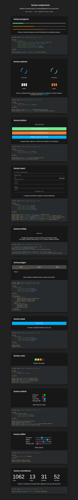

# bunny-components
Web components library - with lit-html

This is a library of dark custom-elements originally built for the mutable-bunnies game. The components will be broken out into a separate repository (this) for reuse.

### Components

Currently available components,

| Tag  | Description |
| ------------- | ------------- |
| bunny-bar  | Most commonly used as a header or footer.  |
| bunny-box  | A material-like content holder.  |
| bunny-button  | Just a button, click it -> something happens.  |
| bunny-color  | Simply triggers the browser-native picker.  |
| bunny-countdown  | Counts down to the given date.  |
| bunny-icon  | Used to display icons, svg or emojis can be used instead.  |
| bunny-input  | Material-like input field.  |
| bunny-pages  | Switching between views, may combine with tabs.  |
| bunny-progress  | Shows a progress bar.  |
| bunny-slider  | use as a volume slider for example.  |
| bunny-spinner  | shows indeterminate loading progress.  |
| bunny-switch  | just a cool-looking checkbox.  |
| bunny-tab  | Combine with bunny-pages, or don't!  |
| bunny-toast  | displays a brief informative message for limited time.  |
| bunny-tooltip  | shows a message when the neighboring elem. is hovered.  |

Most components can be styled through CSS-properties, although this is limited. Read the source for more information.

**Preview of the available components**

